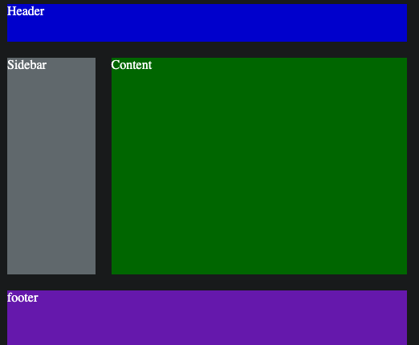
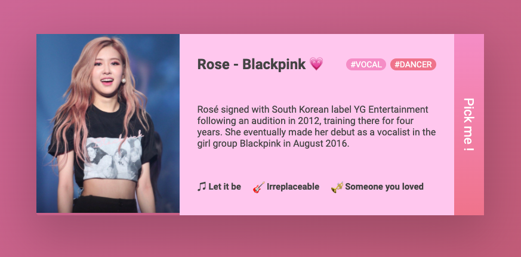
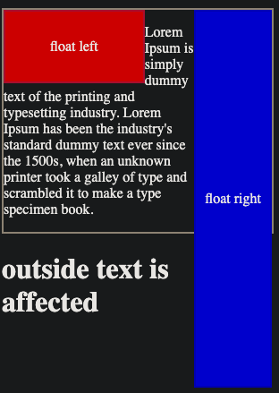
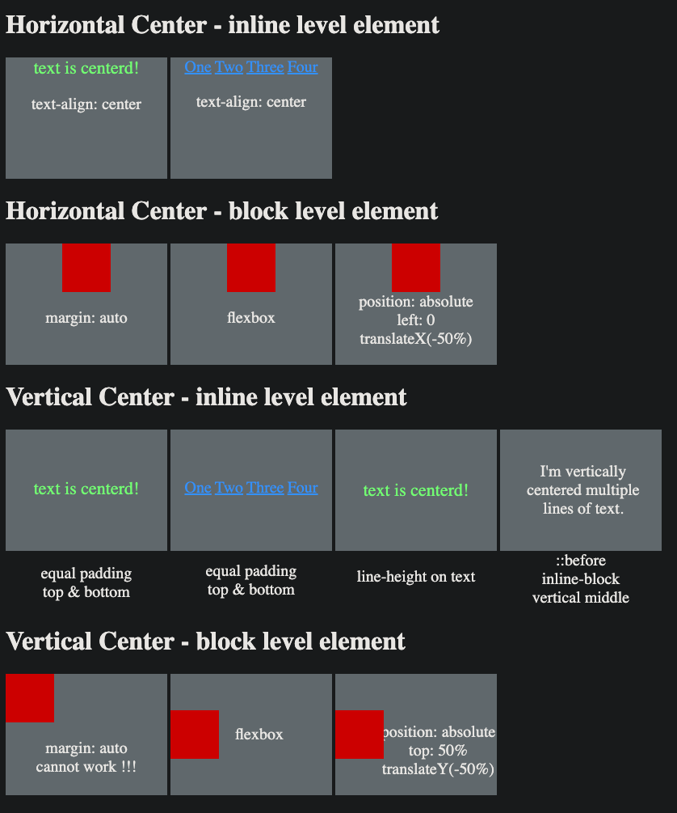
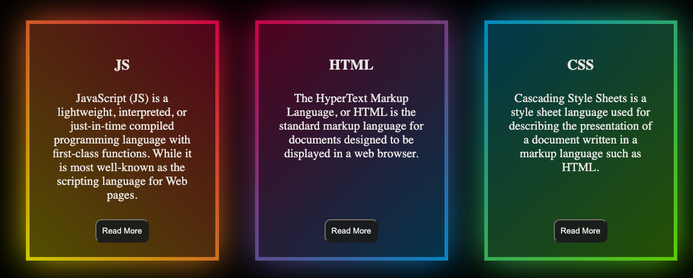
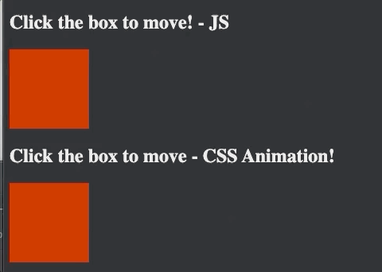

# CSS-onboarding
morden css features practice project

### 1. flexbox example

### 2. progress-bar example

### 3. Animation - Flip Counter  example

### 4. Image Slider - javascript control

### 5. CSS Grid - Convention Layout

### 6. CSS Position

### 7. NameCard felxbox example
-  use flex box
-  use emoj

### 8. css float issue
- clearfix CSS
- clear CSS

### 9. css center issue

### 10. css rotate 3d animation

### 11. Gradient Border - CSS
- :before
- :after
- filter: blur();
- linear-gradient(angle, color1, color2);
- absolute position

### 12. Two ways for box move - JS & CSS
- JS time interval to control position
- CSS animation attribute

