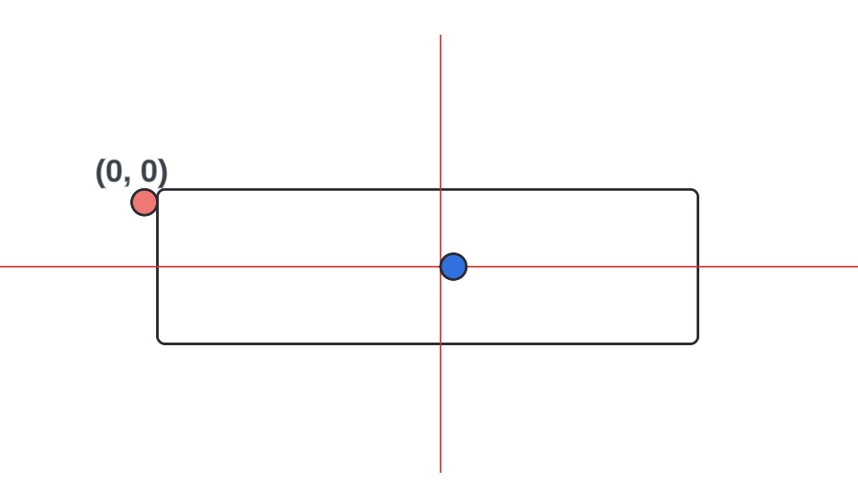
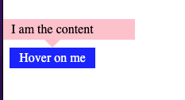

### 1. understand the translate()

original postion is `top-left: (0, 0)`.

The below is `translate(-50%, -50%)`


the below is `translate(-50%, -100%)`


### 2. use "content"

```
// html
<div my_attribute="hello world!" />
// css
content: attr("my_attribute");
```

### 3. ::before & ::after selector
